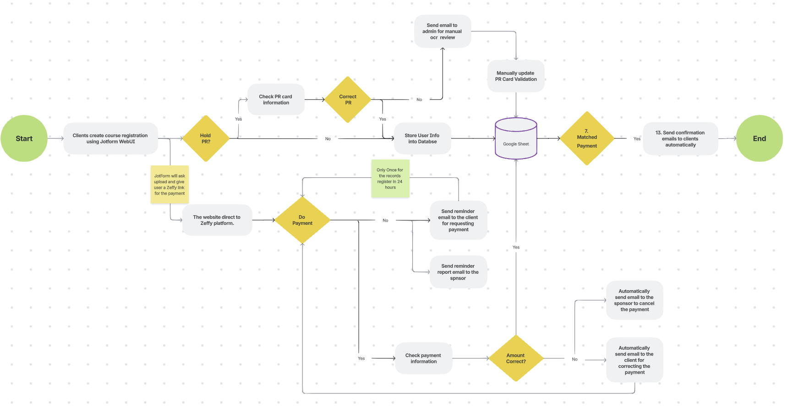

# Registration-Verification-System

Lightweight Flask-based backend for handling registration + payment verification workflows.

This repository provides a small MVC-style Flask application with:
- environment-based configuration (python-dotenv)
- a CSV-backed datastore for local development (and optional MongoDB support)
- background job that checks payment notification emails using an interval scheduler
- modular structure (routes, services, background jobs, utils)

## System Flowchart




## Quick overview

- Project root: contains `pyproject.toml`, `.env.example`, and this `README.md`.
- Application package: `src/app/` (contains config, routes, services, background jobs).
- Entrypoint: `src/main.py` (creates/starts the Flask app).

## Recommended Python

Use Python 3.9 (the codebase uses modern type union syntax and other features). 

## Layout (important files)

```
Registration-Verification-System/
├── .env.example                      # example env with placeholders
├── pyproject.toml
├── png/
│   ├── Phase1-Flowchart.png
│   └── Phase2-Flowchart.png
├── src/
│   ├── main.py                       # application entrypoint
│   └── app/
│       ├── __init__.py               # create_app factory
│       ├── background/
│       │   └── payment_watcher.py     # scheduled payment email watcher
│       ├── config/
│       │   └── config.py              # Config class (loads .env)
│       ├── extensions/
│       │   └── mail.py                # helper to send emails
│       ├── models/
│       ├── routes/
│       ├── services/
│       ├── templates/
│       └── utils/
└── data/
	├── registration_data.csv         # CSV store (created/loaded automatically)
	└── image/
		└── PR Card/
```

## Setup (local development)

1. Clone the repo and cd into it.

2. Quick run with `uv` (fast, minimal) (Ignore this step if you choose run step 3)

If you prefer a very short workflow and already have the `uv` runner available on your machine, you can use it to sync environment and run the app quickly:

```bash
# sync dependencies / environment (if your uv setup supports it)
uv sync
```

Note: `uv` is optional — if you don't have it or prefer a more explicit setup, use one of the normal workflows below.

3. Standard workflows (recommended) (Ignore this step if you choose run step 2)

- Create and activate a virtual environment (recommended):

```bash
python3 -m venv .venv
source .venv/bin/activate
python -m pip install -U pip
```

- Install dependencies.

If you use Poetry (project has `pyproject.toml`):

```bash
poetry install
poetry shell
```

Or with pip (if you maintain a `requirements.txt`) you can do:

```bash
# optional: create requirements.txt from poetry if needed
pip install -r requirements.txt
```

4. Copy and fill the environment file:

```bash
cp .env.example .env
# then edit .env and set real secrets (do NOT commit .env)
```

The code loads `.env` from the repository root using python-dotenv. The `Config` class in `src/app/config/config.py` exposes those env values as attributes.

## Running the app

Run directly with Python (recommended during development):

```bash
python src/main.py
```

If you use the `uv` runner you previously used:

```bash
uv run python src/main.py
```

Visit http://127.0.0.1:5050 (or the host/port from your `.env`) to see the landing endpoint.

## Configuration

- Edit `.env` (copy from `.env.example`) and fill required values: MongoDB creds (if used), AWS/S3 keys (if used), admin email, and scheduler interval `CHECK_ZEFFY_EMAIL_TIME_BY_MINUTES`.
- `src/app/config/config.py` provides a `Config` class that reads env vars and offers `Config.validate_required()` to fail fast on missing required keys.

Notes:
- `CHECK_ZEFFY_EMAIL_TIME_BY_MINUTES` must be an integer; the background scheduler expects a numeric minutes value.
- If you see errors about saving CSV files to a non-existent `data` directory, either create the directory or let the `init_csv` helper create it for you. The repository already contains a `data/registration_data.csv` example.

Additional configuration variables
- `JOTFORM_API_KEY` - (optional) API key used when fetching image URLs hosted by JotForm. When present the utility will append it as `?apiKey=...` to JotForm URLs.
- `NINJA_API_URL` - (optional) Image->text OCR endpoint used by the `ninja_image_to_text` helper (default: `https://api.api-ninjas.com/v1/imagetotext`).
- `NINJA_API_KEY` - (optional but required if you call the Ninja OCR service) API key for the Image->Text API (api-ninjas.com).

## Data storage

- Local development doubles as a CSV-backed datastore in `data/registration_data.csv` (managed by `app.services.database.init_csv`). The service resolves that path relative to the project root so running from other working directories still works.
- For production or scalable scenarios, the app can use MongoDB (`pymongo`) — credentials are loaded from env and the `init_mongoDB` helper shows how to construct the client.

## Background jobs

- The payment watcher uses APScheduler to poll email notifications (see `src/app/background/payment_watcher.py`). Configure the interval via `CHECK_ZEFFY_EMAIL_TIME_BY_MINUTES` in `.env`.

## Routes

All application routes are registered under the `/api` prefix. The main endpoints are:

- POST /api/jotform-webhook
	- Description: Receive JotForm Webhook, structured as URL-encoded key-value pairs in the body of the HTTP POST request.
	- Query params (required): `pr_amount` (float), `normal_amount` (float)
	- Returns: JSON with `registration` (processed registration details) and `identification` (The result of checking PR Card) .
	- Example:

```bash
curl -X POST "http://127.0.0.1:5050/api/jotform-webhook?pr_amount=150&normal_amount=100" \
  -H "Content-Type: application/x-www-form-urlencoded" \
  --data-urlencode "rawRequest={
    'slug': 'submit/253056105937053',
    'q6_legalName': {'first': 'YuYing', 'last': 'Wu3'},
    'q8_email': 'yuying.wu@example.com',
    'q9_phoneNumber': {'full': '+1 647 123 4567'},
    'q26_payersName': {'first': 'YuYing', 'last': 'Wu'},
    'q29_areYou': 'Yes I am',
    'q11_prCard': '0000-0000',
    'clearFront': ['https://files.jotform.com/uploads/example_front_card.jpg'],
    'course': {'products': [{'productName': 'Standard First Aid with CPR Level C & AED Certification'}]}
  }"
```

- POST /api/registration-webhook
	- Description: Receives Course Registration submissions. Expects JSON body.
	- Query params (required): `pr_amount` (float), `normal_amount` (float)
	- Returns: JSON with `message` and `result` (processed registration details).
	- Example:

```bash
curl -X POST "http://127.0.0.1:5050/api/registration-webhook?pr_amount=150&normal_amount=100" \
	-H "Content-Type: application/json" \
	-d '{
  	"slug": "submit/253056105937053",
    "q6_legalName": {
      "first": "YuYing",
      "last": "Wu3"
    },
    "q8_email": "yuying.wu@example.com",
    "q9_phoneNumber": {
      "full": "+1 647 123 4567"
    },
    "q26_payersName": {
      "first": "YuYing",
      "last": "Wu"
    },
    "q29_areYou": "Yes I am",
    "q11_prCard": "0000-0000",
    "clearFront": [
      "https://files.jotform.com/uploads/example_front_card.jpg"
    ],
	"course": {
        "products": [
            {
                "productName": "Standard First Aid with CPR Level C & AED Certification"
            }
        ]
    }
}'
```

- GET /api/check-payments
	- Description: Triggers a one-time scan for payment emails if CFSO_ADMIN_EMAIL_USER and UNIC_ADMIN_EMAIL_USER are set and returns matched results.
	- Query params (optional):
	  - `from` (email address, defaults to `ZEFFY_EMAIL` from config)
	  - `subject` (defaults to `ZEFFY_SUBJECT`)
	  - `since_date` (ISO date string `YYYY-MM-DD`) — if provided, only emails on/after this date will be processed.
	- Returns: JSON with `count` (number of processed emails) and `results` (array of result objects).
		Each result item will typically be one of:

		- Failure example (extraction failed):

	```json
	{
		"update_success": false,
		"message": "Unable to extract payment info from email body",
		"email_subject": "Payment Received - order 12345"
	}
	```

		- Success example (payment info extracted and DB update attempted):

	```json
	{
		"Full_Name": "Name",
		"Actual_Paid_Amount": 150.0,
		"Payment_Status": true,
		"Paid": true,
		"Course": "Course Name",
		"Course_Date": "November 9, 2025 at 9:30 AM EST"
	}
	```
	- Example:

```bash
curl "http://127.0.0.1:5050/api/check-payments?from=no-reply%40gmail.com&subject=Payment+Received&since_date=2025-10-01"
```

- POST /api/check-identification
	- Description: Submit an image for PR Card. The endpoint currently expects a JSON body with an `image_url` pointing to the image to analyze. The service will fetch the image, run OCR and heuristics, and return an identification result.
	- Body (application/json):
	  - `image_url` (string, required) — public URL pointing to the image to analyze. Example values: a direct image link (`https://.../image.jpg`) or a hosting URL that contains an `` tag (the helper will extract the first image found).
	  - `registration_data` (json) - course registration detail, only if match return valid result
	  	- `Full_Name` (required)
		- `PR_Card_Number` (required)
		- `Phone_Number`
		- `Email`
		- `Form_ID`
		- `Submission_ID`
		- `Course`
	- Returns: JSON representation of the `IdentificationResult` dataclass with the following fields:
	  - `doc_type` (array of string): candidate document types detected (e.g. `["PR_CARD"]`).
	  - `is_valid` (boolean): whether the document is considered a valid match.
	  - `confidence` (float): confidence score between 0.0 and 1.0.
	  - `reasons` (array of string): human-readable reasons / cues used for the decision.
	  - `raw_text` (array of string): OCR-extracted text lines / tokens used by the heuristics.
	- Example request (curl):

```bash
curl -X POST "http://127.0.0.1:5050/api/check-identification" \
  -H "Content-Type: application/json" \
  -d '{"image_url": "https://example.com/path/to/document.jpg"}'
```

	- Example response (200):

```json
{
  "doc_type": ["PR_CARD"],
  "is_valid": true,
  "confidence": 0.78,
  "reasons": ["PR Card Check confidence is higher than the threshold."],
  "raw_text": ["canada", "permanent", "resident", "name", "doe, jane"]
}
```

## Image utilities & OCR

The helpers in `src/app/utils/image_utils.py` are small, composable building blocks used in sequence depending on your input source (URL or local file). They handle HTML pages that embed images, convert image bytes to OpenCV arrays, and provide both local (Tesseract) and remote (Ninja OCR) OCR paths.

Typical workflows

- URL → remote OCR
  1. Call `get_image(source='URL', imgURL=...)` downloads image bytes and use the module's `bytes_to_cv2` helper to convert bytes to an OpenCV ndarray. If the URL returns HTML, the helper extracts the first `` and follows it. If `JOTFORM_API_KEY` is set it will be appended to JotForm-hosted URLs.
  2. Preprocess/crop with `image_preprocess` to do edge detection and grayscale.
  3. Call `ninja_image_to_text(image_or_bytes)` to send the image to the remote OCR endpoint (requires `NINJA_API_KEY`).

- URL → local OCR (Tesseract)
  1. Load with `get_image(source='PATH', imgPath=...)`.
  2. Preprocess/crop with `image_preprocess` to do edge detection and grayscale.
  3. Call `local_image_to_text(image_array)` which uses `pytesseract` for OCR.

Notes
- `ninja_image_to_text` accepts a NumPy ndarray, raw bytes, or a PIL Image — it encodes to JPEG before sending to the remote API. Ensure `NINJA_API_KEY` is set in `.env` when using the remote service.

Dependencies
- These helpers use the following third-party packages; ensure they are installed in your environment (they are listed in `pyproject.toml`):
	- `requests` — HTTP requests
	- `beautifulsoup4` (`bs4`) — HTML parsing
	- `pillow` (`PIL`) — image decoding/fallback
	- `numpy` — array / ndarray handling
	- `opencv-python` (imported as `cv2`) — image processing and computer vision
	- `pytesseract` — Python wrapper for the Tesseract OCR engine

Additional system dependency:
- Tesseract OCR binary (required by `pytesseract`). Install on macOS with `brew install tesseract` or on Debian/Ubuntu with `sudo apt install tesseract-ocr`.

# 📧 Automated Notification Reference Guide

This guide outlines the automated email notifications generated by the webhook processing system, providing context and next steps for operational staff and clients.

---

## 🧑‍💻 Staff Notifications (Action & Review Required)

These notifications alert staff to system failures, payment discrepancies, or validation errors.

### 1. System/Database Errors

| Key | Subject | Emoji Key | Reason | Action Required | Difficulty |
| :--- | :--- | :--- | :--- | :--- | :--- |
| **1.1** | **Manual Review: Failed to Save Registration Data** | 🚨 | JotForm data failed to save to the database. | Confirm database availability and connection. | ★★★ |

### 2. Payment Matching Errors (Zeffy)

| Key | Subject | Emoji Key | Reason | Action Required | Difficulty |
| :--- | :--- | :--- | :--- | :--- | :--- |
| **2.1** | **Review: Payment Mismatch (Payer Notified)** | 💰 | Actual payment $\neq$ Expected amount. Payer was successfully notified of cancellation. | Go to database; verify **`Amount_of_Payment`** vs. **`Actual_Paid_Amount`**. Await client repayment. | ★★ |
| **2.2** | **Review: Payment Mismatch (Payer Not UN-notified)** | 📧 | Payment mismatch occurred, but the system could not send the cancellation email (Email missing or invalid in the database). | Manually check other contact information (phone, etc.) to inform the client of the payment cancellation. | ★★ |
| **2.3** | **Review: Failed to Update Payment Record** | ❌ | System failed to locate or update the database record. Possible issues: zero matches or multiple matches for the "Full\_Name" and "Course" combination. | Manually search the database using "Full\_Name" and "Course" to resolve the ambiguity. | ★★ |
| **2.4** | **Review: Payment Check - Other Error** | ❓ | An unknown error occurred during the Zeffy payment verification process. | N/A (Contact IT). | ★★★ |

### 3. PR Card Verification Errors (OCR)

| Key | Subject | Emoji Key | Reason | Action Required | Difficulty |
| :--- | :--- | :--- | :--- | :--- | :--- |
| **5.1** | **PR Card Check Confidence HIGH** | ✅ | OCR confidence score for the PR Card is above the acceptance threshold, proving it's a real PR card. | None. The card is implicitly approved. | ★ |
| **5.2** | **Review: Hand-Written Note Detected** | ✍️ | OCR detected minimal structured text; the upload is likely a hand-written note or a heavily processed image. | Manually check the uploaded PR Card file. | ★★ |
| **5.3** | **Review: Driver’s Licence Cues Detected** | 🚫 | OCR detected features consistent with a driver’s licence instead of a PR Card. | Manually check the uploaded file to confirm the document type. | ★★ |
| **5.4** | **Review: Low PR Card Keyword Confidence** | ❓ | The confidence score for identifying the image as a PR Card is below the threshold. | Manually check the uploaded file. | ★★ |
| **5.5** | **Review: ID/Name Mismatch** | 🔀 | The name or ID number extracted from the PR Card image does not match the information entered in the registration form. | Manually verify the PR Card information against the form data in the database. | ★★ |
| **5.6** | **Review: Cannot Extract ID Number** | 📸 | The uploaded image is too blurry, cropped, or dark to extract the ID number. | Manually check the uploaded file for clarity. | ★★ |
| **5.7** | **Review: Failed to Update OCR Database** | 🔄 | System failed to update the database record after OCR, possibly due to a missing or duplicated record. | Manually check the database to resolve the record issue. | ★★ |
| **5.8** | **Review: OCR - Other Error** | ❓ | An unknown error occurred during PR Card processing. | N/A (Contact IT). | ★★★ |

---

## 4. Staff Notifications (Confirmation/Pending)

These notifications are for staff awareness and require minimal to no immediate action.

| Key | Subject | Emoji Key | Reason | Action Required | Difficulty |
| :--- | :--- | :--- | :--- | :--- | :--- |
| **3.1** | **[\*Course Name\*] Registration Confirmed** | ✅ | Client's registration, identification, and payment are all confirmed and valid. | None. The process is complete. | ★ |
| **4.1** | **[\*Course Name\*] OCR Validation Passed** | ✅ | PR client registered, and the PR Card OCR validation was successful. | Await payment confirmation. | ★ |
| **4.2** | **[\*Course Name\*] No OCR Validation Needed** | ✅ | Non-PR client registered. | Await payment confirmation. | ★ |

---

## 5. Client Notifications (Direct Feedback)

These are the emails sent directly to the client.

| Subject | Emoji Key | Reason & Key Message | Status |
| :--- | :--- | :--- | :--- |
| **Action Required: Payment Mismatch for Course Registration** | 🚨 | Your payment amount was **incorrect** and has been **cancelled**. Please review the course fees and make a new payment for the correct amount to secure your spot. | **Payment Failed** |
| **Confirmation: Your Spot in [\*Course Name\*] is Secured!** | ✅ | All registration details and payment validations have passed. Your spot in the course is confirmed. | **Confirmed** |


## Development tips & common troubleshooting

- Python version: Use 3.9.
- Missing `data` directory: create it or ensure `init_csv` runs (it attempts to create the parent path if needed).
- Ensure `.env` is present in the project root when running locally. Use `.env.example` as a template.

## 🚧 Future Edge Cases for Development

The following issues represent limitations in the current system logic, primarily around course selection, date handling, and payment matching. Addressing these will significantly improve system robustness.

### 1. Handling Course Quantity Selection

| Current Limitation | Proposed Future Fix | Priority |
| :--- | :--- | :--- |
| **Jotform allows clients to select a quantity (e.g., 2 spots)** for a single course via its product list, but the current webhook/database logic assumes **one registration record = one course.** The system cannot correctly track or process submissions for multiple spots/quantities. | **Implement Quantity Splitting Logic.** If the Jotform submission includes a quantity greater than one, the webhook processor must **automatically create and insert separate, distinct registration records** in the database (one for each spot purchased). The total payment amount must be correctly distributed or verified against the total quantity. | **High** |

---

### 2. Standardizing Course Name and Date for Matching

| Current Limitation | Proposed Future Fix | Priority |
| :--- | :--- | :--- |
| **Course dates/options are treated separately** from the core course name in Jotform/Zeffy. The course date is not consistently included as a permanent part of the **Course Name** used for Zeffy payment matching, leading to ambiguous matching (e.g., distinguishing between "SFA - Nov 9" and "SFA - Dec 1"). | **Enforce Standardized Course Keys.** Modify the Jotform field and the regex logic to ensure the **Course Name** extracted **always includes the date or specific option** (e.g., `Standard First Aid (Nov 9)`). This composite key must be the exact value used for payment matching in the Zeffy notification and stored in the database. | **High** |

---

### 3. Mismatched Dates Between Registration and Payment

| Current Limitation | Proposed Future Fix | Priority |
| :--- | :--- | :--- |
| If a client registers for a course date via **Jotform (Date A)** but then manually selects a different date/product via **Zeffy (Date B)**, the final database record currently reflects **Date A** (the Jotform submission), creating a booking error. | **Payment-Driven Date Correction.** Implement logic to compare the registered course/date (from Jotform) with the final course/date identifier in the **Zeffy payment notification**. If a discrepancy exists, the system should **override the Jotform date** and update the database record to reflect the date selected during the **Zeffy payment process (Date B)**, as this confirms the client's final purchase intention. | **Medium** |

### 4. Upload image orientation & format

| Current Limitation | Proposed Future Fix | Priority |
| :--- | :--- | :--- |
| Uploaded PR card images may be portrait/rotated or submitted as PDFs, causing OCR and heuristic failures. | Enforce image-only uploads (reject PDFs) and require the card to be uploaded in landscape orientation with the Canadian flag / "Government of Canada" text positioned at the top. Add validation in the upload pipeline to: (1) reject non-image MIME types (e.g., application/pdf), (2) check image orientation (width >= height) and attempt auto-rotation using EXIF when possible, and (3) return a clear client-facing error instructing the user to upload a JPG/PNG image of the PR card in landscape orientation with the flag at the top if validation fails. | High |

## Git / secrets

- This project includes a `.gitignore` which contains `.env` and local virtual environment directories. Do NOT commit `.env`.
- Keep a cleaned `.env.example` in the repo with placeholder values so teammates know required keys.

## Contributing

1. Create a branch: `git checkout -b feat/your-change`
2. Commit and push, then open a PR wait for approve.

